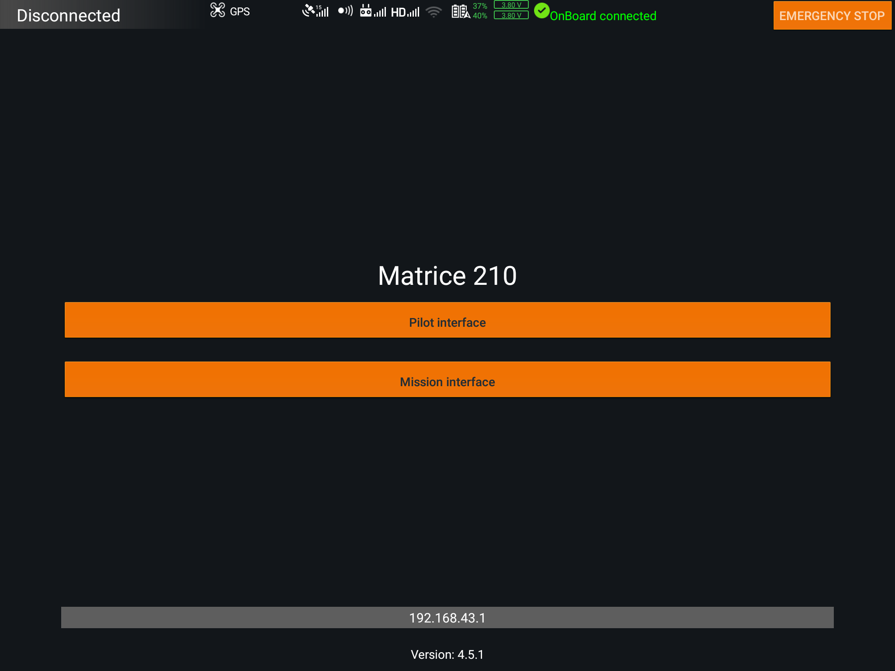
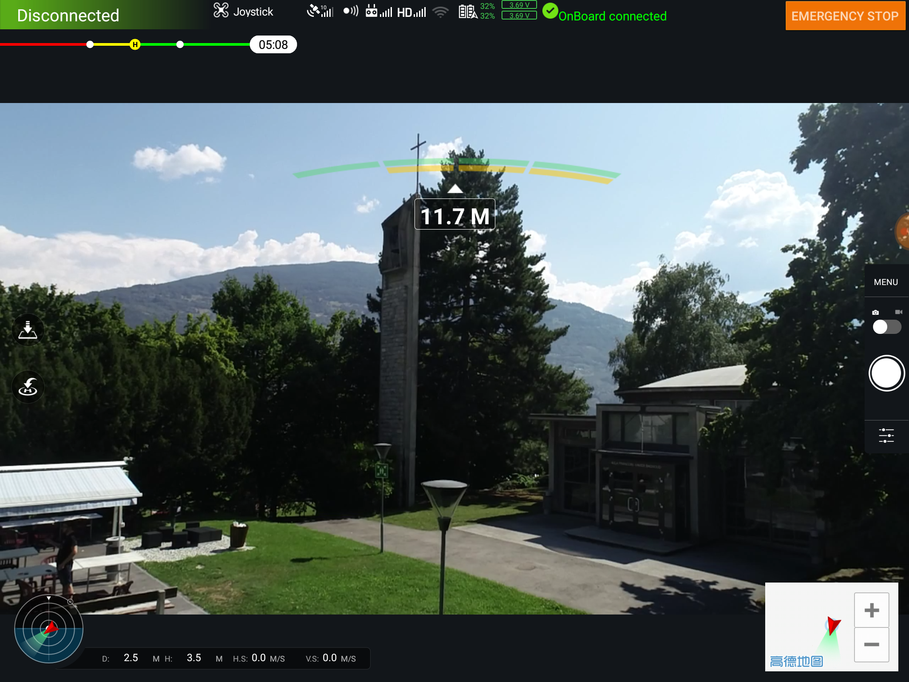
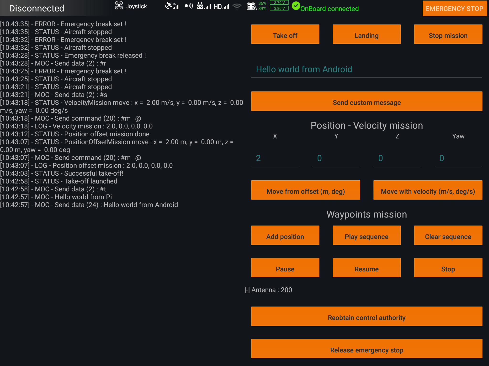

# Matrice210Android
This code uses [DJI Mobile SDK](https://github.com/dji-sdk/Mobile-SDK-Android) to communicate with DJI remote controllers and aircrafts. 

## Prerequisites

Code developped with [Android Studio](https://developer.android.com/studio/) on a [Crystal Sky](https://www.dji.com/crystalsky) monitor from [DJI](http://dji.com).

You must register as a developer with DJI and create an MDSK application Key, see [here](https://developer.dji.com/mobile-sdk/documentation/android-tutorials/ActivationAndBinding.html).

More informations can be found in the [Documentation](https://developer.dji.com/mobile-sdk/documentation/introduction/index.html).

## Result

The following interface is shown on application launch.

User can chose wich interface he want to use with the buttons. Edit text at the bottom is to use with [DJI Bridge App](https://github.com/dji-sdk/Android-Bridge-App). 

## Usage
For full compatibility, use this code with the [Matrice210Pi](https://github.com/jonathanmichel/Matrice210Pi) code on an Raspberry connected to aircraft and the [Matrice210Stm32](https://github.com/jonathanmichel/Matrice210Stm32) code running on a [STM32F429IDISCOVERY board](https://www.st.com/en/evaluation-tools/32f429idiscovery.html).

## Issues
* If the remote controller doen't connect with the application, try to unplug/replug the mobile device. Android has to ask user wich application he want to use with the usb device connected.
* If the live video stream doesn't not display, relaunch application.
* Be sure embedded code is running on the Pi to use all features

## Authors

* **Jonathan Michel** - *Initial work* - [jonathanmichel](https://github.com/jonathanmichel)
